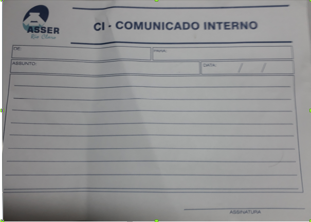

# ATM 2019

# CI-APP: UM SISTEMA DE COMUNICADO INTERNO PARA A FACULDADE ASSER

# Introdução

As Atividades Multidisciplinares do Curso de Graduação em Sistemas de Informação da Escola Superior de Tecnologia e Educação de Rio Claro (ESRC) são partes integrantes do currículo e estão previstas no Projeto Pedagógico, aprovado no âmbito do Colegiado de Curso, sendo esta versão vigente a partir do mês de fevereiro de 2018 (vide respectivo regimento disponível em [1]).
  
Essa atividade será desenvolvida nos moldes de uma Webquest [2] que originalmente foi proposta por Bernie Dodge, professor estadual da Califórnia (EUA) tendo como foco uma metodoligia baseada no da Internet de forma criativa. A Webquest é uma atividade investigativa onde as informações com as quais os alunos interagem provêm da internet.
  
portanto, para desenvolver as atividades siga as Sessões seguintes para poder compreender a atividade que será desenvolida. 
Em síntese, essa Webquest envolve as seguintes disciplinas do semestre atual de 2019: (i) Cálculo Diferencial e Integral II; (ii) Programação Orientada a Objetos; (iii) Programação de Computadores II; (iv) Economia; (v) Circuitos Lógicos; (vi) Algebra Linear; (vii) Relações Etnicas Raciais. 
  
Esse projeto vista o desenvolvimento de um sistema para controle de comucação interna da Faculdade realizada através do formulário – CI (COMUNICADO INTERNO).

A Figura abaixo ilustra o modelo de CI usado atualmente.

### Cronograma

A Tabela a seguir ilustra as datas que devem ser organizas através do Kanban [Cultura Ágil](https://www.culturaagil.com.br/kanban-do-inicio-ao-fim/). Para isso, sugerimos a criação de atividades no menu **Issues do GitHub**

| Data | Fase |
| ------ | ------ |
| 20/04/2019 | Atividade 1 |
| 04/05/2019 | Atividade 2 |
| 18/15/2019 | Atividade 3 |
| 01/16/2019 | Atividade 4 |
| 08/06/2019 | Entrega |

### Fontes
- [WebQuest em PDF](ATIVIDADES_MULTIDISCIPLINARES_2_2019.pdf)
- [FTP da Ativiade Multidisciplinar 2018](http://ftprc.asser.com.br/~eantonio/atm.html)
  
  
